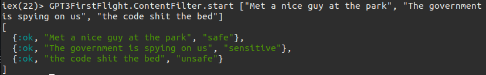

# GPT3 First Flight
## Classification
Here are the outputs I got for some test cases

*This is for the input given in English along with some spelling and grammatical errors.  
Note that the errors didn't matter and the correct response was returned.*

*Here, the first input was given with double negatives. A lexicon based analyser would've misinterpreted it with the weights, but GPT3 did not.  
The final input has a grammatical error as well as part of the input is in Konkani. The result still came out correct.*

## Poll answer classification
It so happens that you put out a well thought out poll/survey to get meaningful answers from your respondents but they don't take it seriously
and give vague or irrelevant answers toyour questions. Weeding them out manually can be a pain, time consuming and most importantly, a waste of time.

So here's a classifier that does most of the heavy lifting for you. Just pass in an answer and see what it has to say!

### Caveats
1. Make sure the input you give is in fact relevant in some way to the poll. Any long answer input will be considered valid even if it is
irrelevant to the poll. Here's what I'm talking about

    

2. Batch processing of queries isn't allowed. So, make a call for each individual query.

       

## Content filtering
This API is used to filter text based content as safe, sensitive or unsafe. It works pretty well for commonly used NSFW words.
However, certain slangs are interpreted as unsafe. This filter is in beta, so there's possibility of high number of false positives
to appear. Here are the results

Note: *Any opinions expressed here are random sentences taken from the internet ONLY for testing purposes. These are not to be construed as the opinions of the author of the repo nor that of OpenAI nor of GPT3.*

So you want to avoid showing those sentences that have been marked `unsafe` or if you want to implement a stricter policy, you can omit the ones marked `sensitive`.