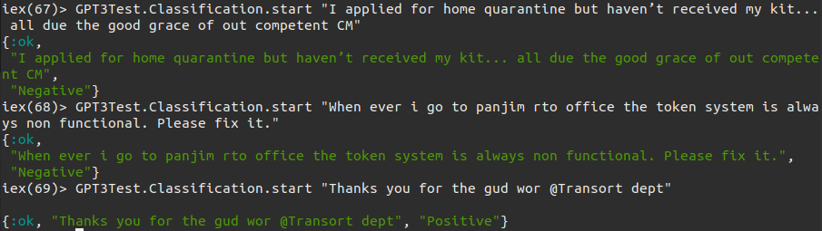
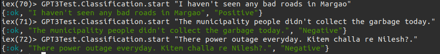
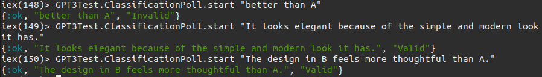

# GPT3 First Flight
## Classification
Here are the outputs I got for some test cases

*This is for the input given in English along with some spelling and grammatical errors.  
Note that the errors didn't matter and the correct response was returned.*

*Here, the first input was given with double negatives. A lexicon based analyser would've misinterpreted it with the weights, but GPT3 did not.  
The final input has a grammatical error as well as part of the input is in Konkani. The result still came out correct.*

## Poll answer classification
It so happens that you put out a well thought out poll/survey to get meaningful answers from your respondents but they don't take it seriously
and give vague or irrelevant answers toyour questions. Weeding them out manually can be a pain, time consuming and most importantly, a waste of time.

So here's a classifier that does most of the heavy lifting for you. Just pass in an answer and see what it has to say!

